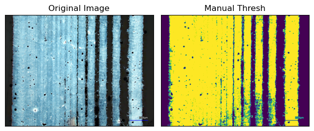
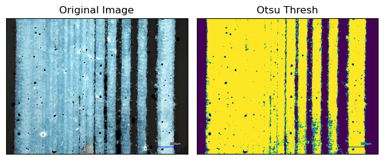
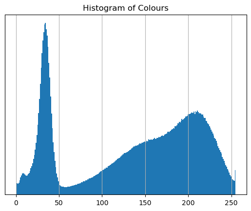

```python
import cv2 as cv 
import matplotlib.pyplot as plt
import numpy as np

img = cv.imread('1.1.png', )
```

### Indexing ###

- if you have a list of items, you can pick an item out of the list based on their position. Counting starts from 0.


```python
letters = ['a', 'b', 'c', 'd', 'e']
letters[0]
```


    'a'


- if you want to extract a **section** of the list, you can indicate the start and end positions with a “:" 


```python
letters[1:3]
```


    ['b', 'c']


- if you want to access the last elements of the list, you may use negative numbers: 


```python
letters[-1]
```


    'e'


```python
letters[-3:-1]
```


    ['c', 'd']


### Numpy Array vs List ###
- **List**: slower than a numpy array, can have mixed data types in it, can't do lots of fancy math 
- **Array**: fast, all elements must be the same data type, can do fancy matrix math (anything possible in matlab)
- can turn an array into a list:


```python
number_array = np.array([1, 2, 3, 4])
list(array)
```


    [1, 2, 3, 4]


- can turn a list into an array:


```python
np.asarray(letters)
```


    array(['a', 'b', 'c', 'd', 'e'], dtype='<U1')


### Contours: ###
- Opencv has a function (cv.findContours) which is our best friend for this project. How is works it that when you feed it a black and white image, it draws out the borders between the black and white parts. From these "contours" you can find a lot of information using the rest of the pre-written functions by opencv, including:

    - area
    - perimeter
    - bounding rectangle 
    - center of mass 
    - "hierarchy" 
    
### Hierarchies: ### 
- cv.findContours outputs 2 arrays when you feed it an image. The first is an array of **contours**, curves joining continuous points. The second is an array of **hierarchies**. There is 1 hierarchy per contour, they are matched by the index (contour 1 has hierarchy 1). 
- The hierarchy consists of 4 pieces of information: [next, previous,child, parent]. The last two are the ones that we are interested in. The "parent" of a contour of the contour that encloses our contour of interest. The child is the contour that is inside our contour. 


- for example, in the image above,4 is a child of 3a, but 3a is a child of 3 
- for more information on hierarchies: https://docs.opencv.org/4.x/d9/d8b/tutorial_py_contours_hierarchy.html

### Thresholding ###

- thresholding turns your image into black and white
- opencv has a function cv.threshold to make thresholding an image easy
- when doing this manually, you must choose values for the upper and lower bound between 0 and 255


```python
# define bounds
lower_bound = 127
upper_bound = 255

# convert image to grayscale
gray = cv.cvtColor(img, cv.COLOR_BGR2GRAY)

# thresh using defined bounds
ret, thresh = cv.threshold(gray, lower_bound, upper_bound, cv.THRESH_BINARY)

# plot
plt.subplot(121), plt.imshow(img)
plt.title('Original Image'), plt.xticks([]), plt.yticks([])
plt.subplot(122), plt.imshow(thresh)
plt.title('Manual Thresh'), plt.xticks([]), plt.yticks([])
plt.tight_layout()
plt.show()
```


    

    


- Otsu thresholding is when opencv chooses the upper and lower bounds for you based on a histogram of the colour distribution of the image


```python
# convert image to grayscale 
gray = cv.cvtColor(img, cv.COLOR_BGR2GRAY)

# otsu threshing
ret_otsu, thresh_otsu = cv.threshold(gray, 0, 255, cv.THRESH_BINARY + cv.THRESH_OTSU)

# plot
plt.subplot(121), plt.imshow(img)
plt.title('Original Image'), plt.xticks([]), plt.yticks([])
plt.subplot(122), plt.imshow(thresh_otsu)
plt.title('Otsu Thresh'), plt.xticks([]), plt.yticks([])
plt.tight_layout()
plt.show()

plt.hist(img.ravel(),256)
plt.title('Histogram of Colours'), plt.yticks([])
plt.grid()
plt.show()
```


    

    


    

    


- to get the otsu histograms of a directory of images, use link: https://github.com/dwnzng/LineRoughness/blob/main/OtsuHistograms.py

### Morphological Operations ###

- morphological operations are ways to process digital images based on their shapes 
- opencv has a function cv.morphologicalEx() performs morphological operations assuming the foreground object is white and the background is black
- cv.morphologicalEx() main operations:  

    - erosion: makes object skinnier 
    - dilation: makes object fatter 
    - opening: erosion followed by dilation, good to remove "noise" 
    - closing: dilation followed by erosion, good to close small holes inside foreground objects
    
- for more information, check this link: https://docs.opencv.org/4.x/d9/d61/tutorial_py_morphological_ops.html
